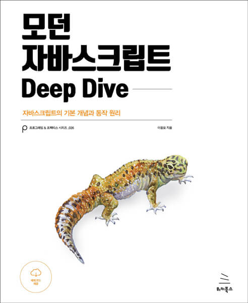

# 모던 자바스크립트 Deep Dive

- 챌린지 참여(2021-05-10 ~ 2021-08-01)
- 챌린지 내용 : `모던 자바스크립트 Deep Dive`를 바탕으로 정리
- 챌린저스 URL : [바로가기](https://chlngers.onelink.me/Ju7U/31a95cd)
- GitHub URL : [바로가기](https://github.com/dynamic-programmers/modern-js-deep-dive)
- 모던 자바스크립트 저자 / 이웅모 지음 : [Youtube](https://www.youtube.com/channel/UCmcB2RZ8OjfS1vqdaGDxzjw/playlists)
- 위의 링크는 챌린지를 참여하는 동안만 한시적으로 공유되는 링크
- 공부를 하면서 수정 및 추가는 지속적으로 업데이트
- 주마다 진행하는 챕터의 개수에 따라 항목이 변경될 수 있다.

#### 1st (deadline: 05-16): 04 ~ 08 (변수, 표현식과 문, 데이터 타입, 연산자, 제어문)

#### 2nd (deadline: 05-23) : 09 ~ 12 (타입 변환과 단축 평가, 객체 리터럴, 원시 값과 객체의 비교, 함수)

#### 3rd (deadline: 05-30) : 13 ~ 16 (스코프, 전역 변수의 문제점, let/const 키워드와 블록 레벨 스코프, 프로퍼티 어트리뷰트)

#### 4th (deadline: 06-06) : 17 ~ 20 (생성자 함수에 의한 객체 생성, 함수와 일급 객체, 프로토타입, strict mode)

#### 5th (deadline: 06-13) : 21 ~ 24 (빌트인 객체, this, 실행 컨텍스트, 클로저)

#### 6th (deadline : 06-20) : 25 ~ 28 (클래스, ES6 함수의 추가 기능, 배열, Number)

#### 7th (deadline: 06-27) : 29 ~ 32 (Math, Date, RegExp, String)

#### 8th (deadline: 07-04) : 33 ~ 36 (Symbol, 이터러블, 스프레드 문법, 디스트럭처링할당)

#### 9th (deadline: 07-11) : 37 ~ 40 (Set과 Map, 브라우저의 렌더링 과정, DOM, 이벤트)

#### 10th (deadline: 07-18) : 41 ~ 44 (타이머, 비동기 프로그래밍, Ajax, REST API)

#### 11th (deadline: 07-25) : 45 ~ 48 (프로미스, 제너레이터와 async/await, 에러처리, 모듈)

#### 12th (deadline: 08-01) : 49 (Babel과 Webpack을 이용한 ES6+/ES.NEXT 개발 환경 구축)
